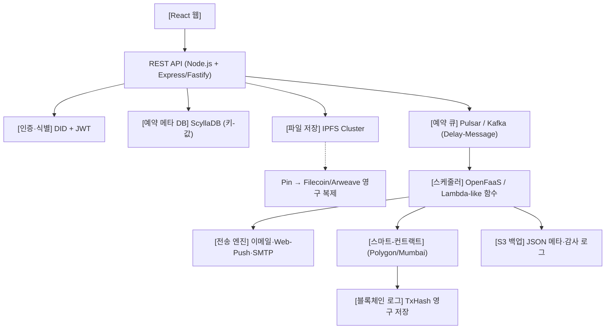

# PRD – “Future-Message (50년 후 전달) 서비스”

## 1. 목표
사용자가 지정된 날짜(최대 50년 후)에 텍스트·사진·영상 등을 **신뢰성 있게** 전달받도록 하는 서비스.

### 핵심 요구 사항
| 번호 | 요구 사항 | 설명 |
|:---:|:---|:---|
| 1 | **시간-정확성** | 예약 시점에 자동적이고 정확하게 전송 |
| 2 | **식별 영구성** | 수신자의 주소나 전화번호가 변동되어도 무관하게 동일한 식별자 사용 |
| 3 | **데이터 영구 보관**| 파일과 메타데이터가 50년 이상 사라지지 않도록 보장 |
| 4 | **전송 증명** | 언제, 누가, 무엇을 전송했는지 블록체인에 변조 불가능한(Immutable) 로그로 기록 |
| 5 | **운영 비용 최소화**| 오픈소스 및 셀프 호스팅 기반으로 설계하여 클라우드 종속성 최소화 |

---

## 2. 전체 아키텍처

### 핵심 흐름
1. **사용자**: 파일·텍스트 업로드 + 수신자 DID + 예약 일시 $\rightarrow$ `/messages` API 호출
2. **API (서버)**:
   - 파일을 IPFS에 `add` $\rightarrow$ CID 반환
   - 메타데이터(CID, DID, 예약일정, SHA-256)를 ScyllaDB에 저장
   - Pulsar Delay Message 큐에 삽입 (`delay = schedule - now`)
3. **예약 시점 (스케줄러)**: OpenFaaS 함수가 큐를 소비
   - CID를 이용해 IPFS에서 파일 스트림 획득
   - 수신자의 DID 공개키로 **AES + RSA 하이브리드 암호화** $\rightarrow$ `encryptedPayload`
   - 스마트 컨트랙트에 `release(messageId, encryptedPayload)` 호출 $\rightarrow$ TxHash 기록
   - 이메일 또는 Web-Push로 `encryptedPayload` 전송
4. **감사 (Audit)**: TxHash와 메타데이터를 S3에 백업하고, 필요 시 블록체인 로그로 전송 사실을 검증

---

## 3. 핵심 개념 정리

| 용어 | 의미·역할 |
|:---|:---|
| **DID (Decentralized Identifier)** | 중앙기관 없이 자체 생성·소유하는 식별자. 공개키와 1:1 매핑되어 '이 DID의 소유자'를 암호학적으로 증명. 주소/전화번호가 변해도 동일하게 사용 가능. |
| **IPFS** | 파일을 '내용-해시(CID)'로 주소화하는 P2P 파일 시스템. 동일한 데이터는 무조건 동일한 CID를 가짐. |
| **Pinning** | CID와 하위 블록을 노드에 영구 보관하도록 선언. 쓰레기 수집(GC) 시 삭제되지 않음. |
| **IPFS Cluster** | 여러 IPFS 노드가 컨트롤 플레인으로 복제 및 핀(Pin)을 관리. 3~5개의 피어에 자동 복제. |
| **Filecoin / Arweave** | IPFS에 핀된 데이터를 경제적 보증을 통해 수십~수백 년 영구 저장하는 분산 스토리지 체인. |
| **CID (Content Identifier)** | 파일 전체를 해싱한 불변 식별자. DB에 저장해 두면 언제든 동일 파일을 찾을 수 있음. |
| **스마트 컨트랙트** | 블록체인에 배포된 프로그램. 본 프로젝트에서는 시간-잠금(releaseAt)과 전송 완료 로그(release) 담당. |
| **블록체인 로그** | 트랜잭션 해시(TxHash). 변조 불가능한 증거로 전송 성공 여부를 검증. |
| **Pulsar/Kafka (Delay-Message)** | 메시지를 예약 시점까지 대기시켰다가 자동으로 소비자에게 전달하는 큐 시스템. |
| **OpenFaaS** | 예약 시점에 경량 함수를 실행하여 파일 암호화, 컨트랙트 호출, 이메일 전송을 수행. |

---

## 4. 마일스톤 & 구현 내용 (원본 계획)

| 마일스톤 | 기간 | 구현 내용 | 산출물 |
|:---:|:---:|:---|:---|
| **1. 프로젝트 토대** | 1~2주 | Monorepo (backend / frontend / infra) Docker-Compose에 Node, IPFS, ScyllaDB, Pulsar 세팅 | `docker compose up` 로컬 환경 |
| **2. DID·JWT 인증** | 3~4주 | `did:key` 생성 API, Challenge-Response 로그인, JWT 미들웨어 | `/auth` 엔드포인트, 테스트 스크립트 |
| **3. IPFS & Pinning** | 5~6주 | 파일 IPFS `add` 후 CID 반환, 로컬 핀 및 외부(Pinata) 연동 | 업로드 UI, CID 발급 확인 |
| **4. ScyllaDB 저장** | 7~8주 | `messages` 테이블 설계 (CRUD API) | DB 스키마, `/messages` API |
| **5. 예약 큐 (Pulsar)** | 9~10주 | Delay-Message Publish & Consumer 연동 | 토픽 및 Consumer 로그 확인 |
| **6. 스마트 컨트랙트** | 11~13주 | `MessageVault` (Polygon Mumbai 배포), Web3 연동 | 컨트랙트 주소, TxHash 반환 |
| **7. 전송 엔진** | 14~16주 | AES-RSA 암호화, Nodemailer SMTP + Web-Push | 전송 로그, 수신(메일/푸시) 테스트 |
| **8. 감사·백업** | 17~18주 | 전송 완료 시 S3 JSON 백업, Prometheus 모니터링 적용 | Grafana 대시보드, CI 파이프라인 |

### 마일스톤 간 의존 관계
- `2 -> 3 -> 4`: 인증이 선행되어야 메타데이터와 파일을 연결 가능.
- `4 -> 5`: 메타데이터가 DB에 존재해야 Delay Message에 ID를 담을 수 있음.
- `5 -> 6 -> 7`: 큐 예약 도달 $\rightarrow$ 스마트 컨트랙트 실행 $\rightarrow$ 실제 발송 순서.
- `7 -> 8`: 발송 성공 시에만 최종 로그 백업 수행.

---

## 5. 위험 및 대응 방안

| 위험 요소 | 설명 | 대응 방안 |
|:---|:---|:---|
| **IPFS Pin 손실** | 노드 다운 시 데이터 유실 가능성 | IPFS Cluster를 통한 다중 복제 및 Filecoin/Arweave 영구 보관망 활용 |
| **DID 키 분실** | 사용자가 비밀키를 분실하면 복구 불가 | 키 생성 시 암호화된 백업 파일 또는 구글 드라이브 동기화 기능 제공 |
| **컨트랙트 버그** | 배포된 블록체인 코드는 수정 불가 | 다중 테스트 후 OpenZeppelin Upgradeable Proxy 패턴 적용 |
| **예약 큐 지연** | Pulsar 과부하 시 타이머 정확도 저하 | 최소 2개의 Broker 구성 및 백업 큐(Redis Delayed-Job) 병행 |
| **법적/프라이버시** | 장기 보관 데이터에 대한 법적 규제 | **데이터 암호화 및 키 관리를 전적으로 사용자에게 위임**하여 서버는 '암호화된 텍스트'만 취급 |

---

## 6. 성공 기준 (KPIs)
- **예약 정확도**: 99.9% 이상 (1분 이내 지연 없음)
- **데이터 영구성**: IPFS Cluster + 블록체인 복제본 3개 이상 유지
- **전송 증명**: TxHash 조회를 통한 발송 사실 증명 100% 성공
- **월 유지 비용**: 자체 인프라 및 최소 클라우드 비용 $200 이하
- **사용자 만족도**: 베타 테스터 100명 중 NPS 8 이상

> *본 PRD는 2026-07-07 기준으로 작성되었으며 향후 기술 및 환경 변화에 따라 업데이트됩니다.*
